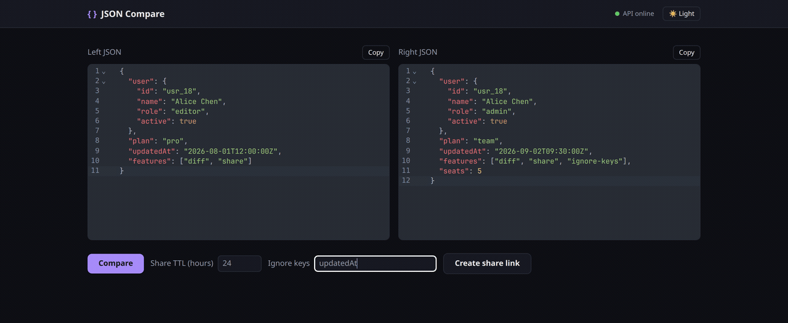
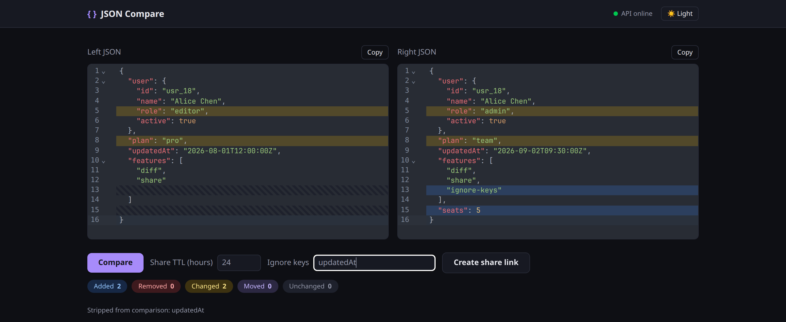
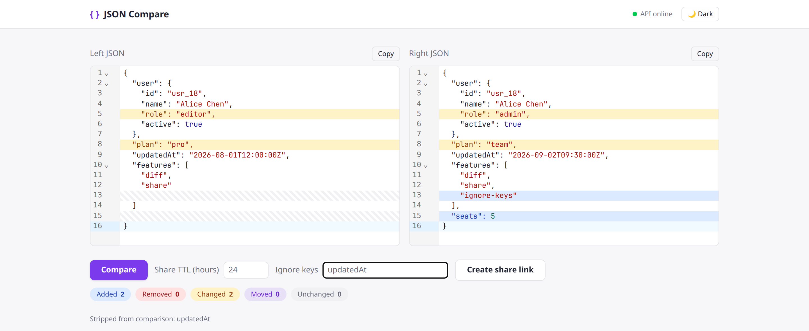

# JSON Compare

Side-by-side JSON diff for API payloads — ignore noisy keys, get a shareable link.

[](https://json-compare-theta.vercel.app)
[](LICENSE)
[](https://go.dev)
[](frontend/)

**[Open the live app →](https://json-compare-theta.vercel.app)**

<p align="center">
  
</p>

Paste two JSON objects, hit Compare, and see added / removed / changed / moved lines lined up in both panes. Volatile fields like `updatedAt` can be ignored. A share link stores the diff for anyone with the URL.

<p align="center">
  
</p>

<p align="center">
  
</p>

## Features

- **Line-aligned diff** — both editors always show the same number of rows; added or removed keys get placeholder lines so the rest of the payload stays visually locked.
- **Synced scrolling** — scroll one pane and the other follows by line index, not just pixel offset.
- **Ignore keys** — comma-separated names, matched at any nesting depth (`updatedAt`, `_id`, `requestId`, …). Ignored keys stay in the editors but are stripped from the comparison and from shares.
- **Share links** — store a diff in Redis under a short ID (`/share/:id`) with a configurable TTL.
- **Export** — download a stored share as JSON delta or a human-readable text diff.
- **Dark / light theme** — follows the system, or toggle in the header.

## Quick start

```bash
docker compose up --build
```

API: `http://localhost:8080` · Redis is started for you.

Frontend (separate terminal):

```bash
cd frontend
cp .env.example .env   # VITE_API_BASE_URL=http://localhost:8080
npm install
npm run dev
```

Opens `http://localhost:5173`.

Without Docker: start Redis, `cp .env.example .env`, then `go run ./cmd/server`.

## Stack

| Layer | Choice |
| --- | --- |
| API | Go + [Gin](https://github.com/gin-gonic/gin) |
| Store | Redis (share TTL, default 7 days) |
| Diff | [gojsondiff](https://github.com/yudai/gojsondiff) → [jsondiffpatch](https://github.com/benjamine/jsondiffpatch) delta *format* |
| UI | React + Vite + TypeScript + Tailwind in `frontend/` |
| Editors | CodeMirror, plus a custom renderer in `frontend/src/lib/lineDiff.ts` |

The frontend does not depend on the `jsondiffpatch` library. It walks the delta shape and builds the side-by-side view itself.

## API

All `/api/v1/*` routes are rate limited per client IP (`/healthz` is not). Over the limit: `429` with `{"error": "rate limit exceeded, slow down"}`.

### `GET /healthz`

Pings Redis.

```bash
curl localhost:8080/healthz
```

### `POST /api/v1/diff`

Stateless diff — no persistence. Returns the delta and summary stats.

```bash
curl -X POST localhost:8080/api/v1/diff \
  -H "Content-Type: application/json" \
  -d '{
        "left":  {"name": "Alice", "age": 30, "active": true},
        "right": {"name": "Alice", "age": 31, "role": "admin"}
      }'
```

```json
{
  "delta": {
    "age": [30, 31],
    "role": [{"role": "admin"}],
    "active": [true, 0, 0]
  },
  "stats": {"added": 1, "removed": 1, "changed": 1, "moved": 0, "unchanged": 1},
  "modified": true
}
```

### `POST /api/v1/shares`

Computes the diff once and stores it in Redis. Optional `ttl_hours` (clamped to `MAX_SHARE_TTL_HOURS`, default 720 / 30 days).

```bash
curl -X POST localhost:8080/api/v1/shares \
  -H "Content-Type: application/json" \
  -d '{
        "left":  {"name": "Alice", "age": 30},
        "right": {"name": "Alice", "age": 31},
        "ttl_hours": 24
      }'
```

```json
{"id": "aB3xQ9kLmZ", "url": "/api/v1/shares/aB3xQ9kLmZ", "expiresAt": "2026-08-02T13:00:00Z"}
```

### `GET /api/v1/shares/:id`

Stored record (`left`, `right`, `delta`, timestamps). `404` if missing or expired.

### `GET /api/v1/shares/:id/export?format=json|text`

`json` = raw delta · `text` = ASCII diff.

```bash
curl -OJ "localhost:8080/api/v1/shares/aB3xQ9kLmZ/export?format=text"
```

## Testing

```bash
go test ./...
```

## Current limits

- No auth — anyone with a share ID can view or export it.
- Rate limit is a per-IP in-memory token bucket (`RATE_LIMIT_RPS` / `RATE_LIMIT_BURST`, default 2 req/s, burst 10). It resets on restart and is not shared across replicas.
- CORS defaults to `*` via `ALLOWED_ORIGIN` — set the real frontend origin outside local dev.
- Top-level `left` / `right` must be JSON **objects** (not bare arrays or scalars).
- No automated frontend tests yet.
- Array alignment in the side-by-side view is best-effort for deep or heavily reordered arrays.

## GitHub listing

After merging, set these in the repo **About** panel so GitHub search and link unfurls match the product:

| Field | Value |
| --- | --- |
| Description | Side-by-side JSON diff with ignore-keys and shareable links |
| Website | https://json-compare-theta.vercel.app |
| Topics | `json`, `json-diff`, `diff`, `go`, `react`, `developer-tools` |
| Social preview | Upload [`docs/social-preview.png`](docs/social-preview.png) (1280×640) |

## License

[MIT](LICENSE)
